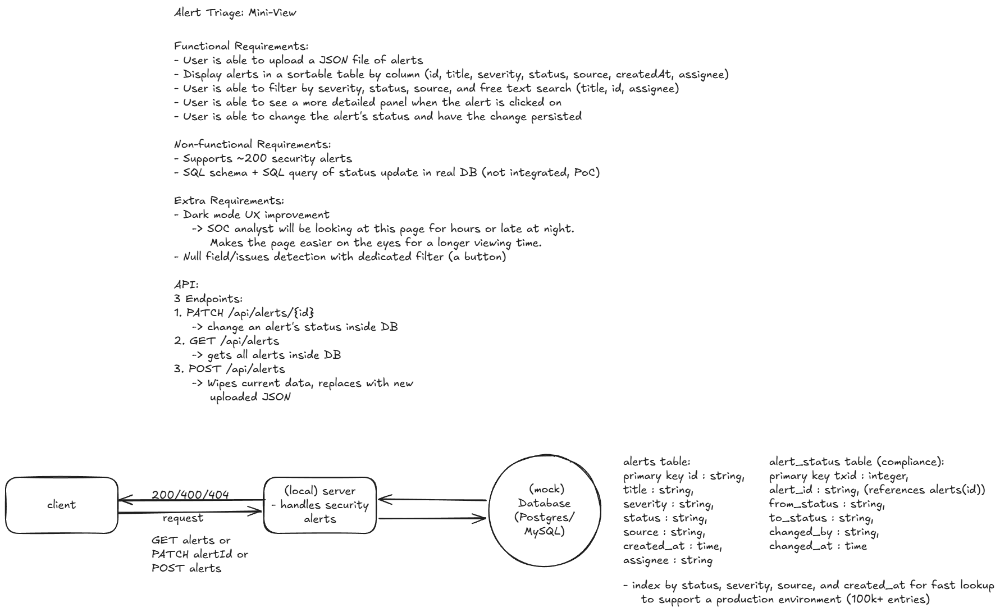

# Alert Triage Mini-View

A Next.js + TypeScript page for triaging ~200 mock security alerts with the following supported functionalities:  
1. **upload** a JSON file,  
2. **filter / sort / search** sort by any column, filter and search across key fields.
3. A more **detailed panel** when an alert is clicked,  
4. The ability to **change an alert's status** inside the detailed panel, saved to (mock local) database for persistence.

## Video Demo
https://youtu.be/iGObIl6Szxc

## Quick Start
```bash
npm install
npm run dev            # runs on http://localhost:3000
```

Then click **Choose file** and upload `data/alerts.json` (200 clean alerts) — or
`data/alerts-with-issues.json` to exercise the data-quality handling (12 flagged rows).
The mock store is in-memory — **restart the dev server to reset to the empty upload state**.

> Requires Node 20.9+ (built on Node 24 LTS).
> Regenerate the dataset any time with `node scripts/generate-alerts.mjs`.

## Features
- **Upload** a JSON file: a file with missing/invalid fields still loads instead of being rejected.
- **Data-quality handling**: a dismissible warning banner summarizes issues, unparseable
  or missing fields are highlighted red in the table and detail panel, and an
  **"Issues only"** toggle filter to display invalid rows:  
    A null `assignee` is treated as a normal "Unassigned". A missing `id` is auto-filled and flagged.
- **Sortable** table on every column (severity by rank, created by timestamp).
- **Filter** by severity / status / source + **free-text search** (title, id, assignee).
- **Detail split panel** on row select; missing fields are clearly marked.
- **Change status** using `PATCH /api/alerts/{id}`.  
   **Persists in the mock DB** (fixing a missing status clears its red flag).
- **Dark mode** toggle.

## System Design



## Architecture & Key Decisions
| Decision | Why / trade-off |
|---|---|
| **High level system design done by myself** | The AI generated design was over engineered and too complicated for a small system like this project with a local scope. The tradeoff is between simplicity and readability vs. scalability/production-ready. Although it was easier to transition the AI generated design into a production-ready product, it is more important to first understand and create a simple MVP before moving on to a more complex design. My high level system design is saved as sysdesign.png.|
| **Use and implement a mock database interface for in memory storage** | The mock database used in my app implements the `AlertRepository` under `lib/db.ts`. I chose to use and implement an interface instead of directly using the class because it was an easy way to improve the scalability of my app without adding too much complexity. For production, I would want to replace this by integrating the database I created with my SQL schema (Postgres/MySQL) by creating a class, `PostgresAlertRepository` that implements the same three methods in the interface and the rest will continue working.|
| **Lenient JSON field validation**| Input validator for the upload doesn't reject messy files if they are in a proper JSON format. Invalid field values are recorded so most files still load and alert the user using red cells and warnings. Only structural JSON errors (not an array / empty) return 400. Allows for JSON upload to be more robust and resilient to small errors. |
| **Optimistic status update with visible rollback**| Changing an alert's status updates the UI immediately instead of waiting on the server, so changes feel snappy. If it fails, the status rolls back to its previous value and a notification alerts the analyst. The trade-off here is perceived speed vs. correctness. This decision preserves the responsiveness of the app while also letting the analyst know if something did not update in the backend properly. |

## UX Improvement

**Dark mode implementation**: A toggle for a dark mode that makes the background black while maintaining readability for all text. SOC analysts will be working with this page for hours at a time and many people enjoy working with a dark background, especially in the evening. This change would make the chart easier to work with since it will be easier on the eyes after prolonged exposure.

## AI Usage

- **Tool:** Anthropic's Claude Code (Opus 4.8, thinking enabled)
- **Tasks delegated to AI**: UI implementation, data processing, alerts.json test data generation, code review, debugging. 
- **Where I overrode it:**
1. The proposed initial architecture was over engineered. It involved features like random failure injection, an audit endpoint, client-side data storage, and other features that I felt were too complicated or out of scope. I ended up creating my own architecture using Excalidraw and used the AI agent to implement my design.
2. Deleted an undo status change feature that was implemented without my approval. This feature I feel wasn't necessary because if the SOC analyst made a mistake, they would just have to select the same alert again and fix it. Removed to reduce UI clutter.
3. Rewrote AI generated condensed code to make it more readable. AI sometimes likes to compact multiple lines into a single line using shortcuts when it's possible. Although this makes the code concise, it's not always the most readable for human engineers.
4. Replaced optimistic concurrency control implementation for status updates with a simple single writer SQL query. This SQL query will not work for concurrent writers to the same DB, but rewrote it for simplicity reasons. Concurrency not needed for single writers, but will need to be implemented for production detailed below.
5. Replaced optimistic status update with silent rollback with optimistic status update with visible rollback feedback. The first implementation creates a disconnect between what the SOC analyst thought they did vs. what actually happened in case the change could not be successfully written to the database. The new implementation removes this disconnect by letting the analyst know that a status failed to update so that they can try it again. This implementation keeps the instant feedback from every status update while also reducing user frustration.

## What I'd do differently for production

- Real Postgres/MySQL database integration using an `AlertRepository` interface implementation.
- Rewrite `update-status.sql` to implement optimistic concurrency or another algorithm to ensure that all updates are atomic to prevent lost updates between multiple analysts working the same database.
- Create an auth endpoint for SOC analysts to log in and also support session persistence (refresh + access tokens?).
- Horizontal scaling of the app (create more instances) and create read replicas of the DB to support higher traffic
- Create a CI/CD pipeline to ensure all unit tests pass before allowing PR approvals.
- Move filtering and sorting off the client and into the server. ~200 entries is fine for the client to handle but if ~100k entries are uploaded, the client will slow to a crawl.
